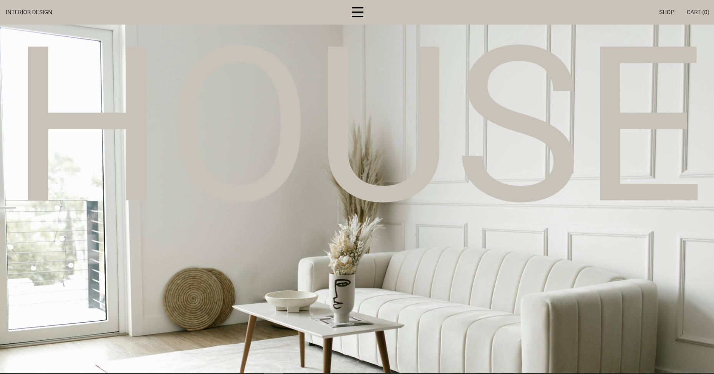

# Landing Page Design Interior 

[Visite o site clicando aqui](https://super-cucurucho-5d132a.netlify.app)

## Descrição

O projeto **Design Interior Agency** é uma landing page moderna e minimalista desenvolvida para uma agência de design de interiores. O site apresenta um design responsivo e atraente, destacando os serviços da agência, os projetos realizados, e informações de contato, proporcionando uma experiência agradável aos visitantes.

## Tecnologias Utilizadas

- HTML
- CSS
- JavaScript
- GSAP (GreenSock Animation Platform) para animações dinâmicas

## Funcionalidades

- **Seções Dinâmicas**: A landing page inclui seções como "Sobre", "Projetos", "Serviços" e "Contato", cada uma projetada para destacar os aspectos únicos da agência.
- **Animações Elegantes**: Utilização do GSAP para criar animações suaves e envolventes que melhoram a experiência do usuário.
- **Design Responsivo**: O layout é otimizado para funcionar em dispositivos de diferentes tamanhos, garantindo que a página seja acessível tanto em desktops quanto em dispositivos móveis.

